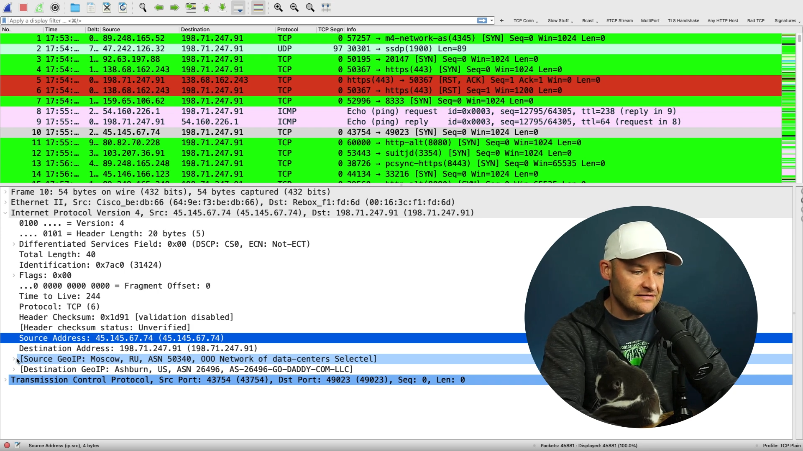
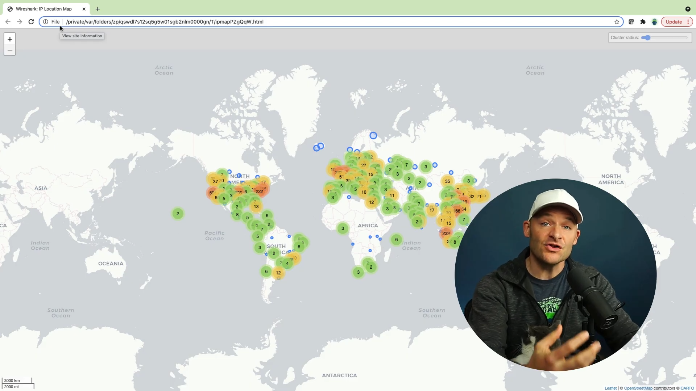
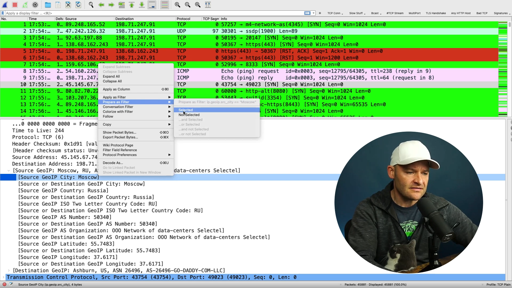

# Map IP Addresses Locations with Wireshark
To have a better visualisation of where the packet capture is receiving traffic from, you can perform certain configurations to enable you to view on a map where you are receiving the traffic from.

## Configurations
1. Go to the website https://dev.maxmind.com/geoip/geolite2-free-geolocation-data/?lang=en  
2. Create an account 
3. Download the ASN, Country and City files (.mmdb), the GZIP files 
4. Extract the files twice to get the .mmdb file
5. Save only the .mmdb files into a new folder 
6. In wireshark, go to `Edit` > `Preferences` > `Name Resolution` > `MaxMind database directories`, select the path to your folder 

## Viewing the location
Once you have completed the settings, you can see the locations from the packet information as shown below.  

 

You can also view all the IP locations on a map. Go to `Statistics` > `Endpoints` > `Map` > `View in browser` 

 

<b>Note:</b> Make sure to constantly update the databases

## Filter by location
You can also filter the packet capture list by the location. Right click the location > `Prepare as filter` > `Selected`.  

 