# Intro to Wireshark
## Setting profiles
A profile is a set of configurations that can be saved and applied on any packet capture. The current profile can be found at the bottom right of the packet capture as shown below. 
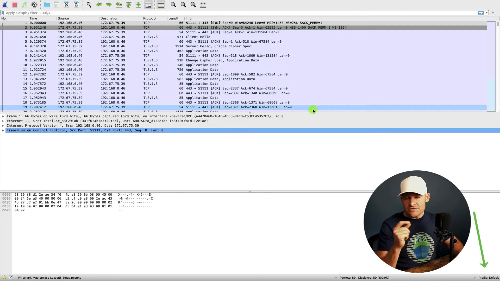 

To create a new profile, you can right click the profile at the bottom right > `New` > Set the profile name you want.

## Zoom and column adjustments
To zoom in, you can click on the magnifying glass with the + at the top. To adjust the column, you can press the icon just beside the magnifying glass, it will adjust so that you can view the full value.

## Adjust Layout
To adjust the layout, `Edit` > `Preferences` > `Appearance` > `Layout`.  
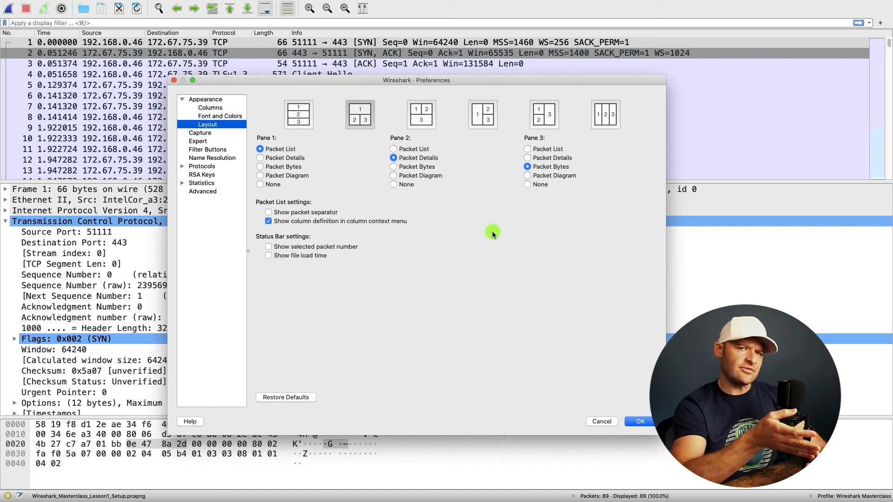 

If you select `Packet Diagram`, you can view the packet as a diagram instead of just seeing bytes. 
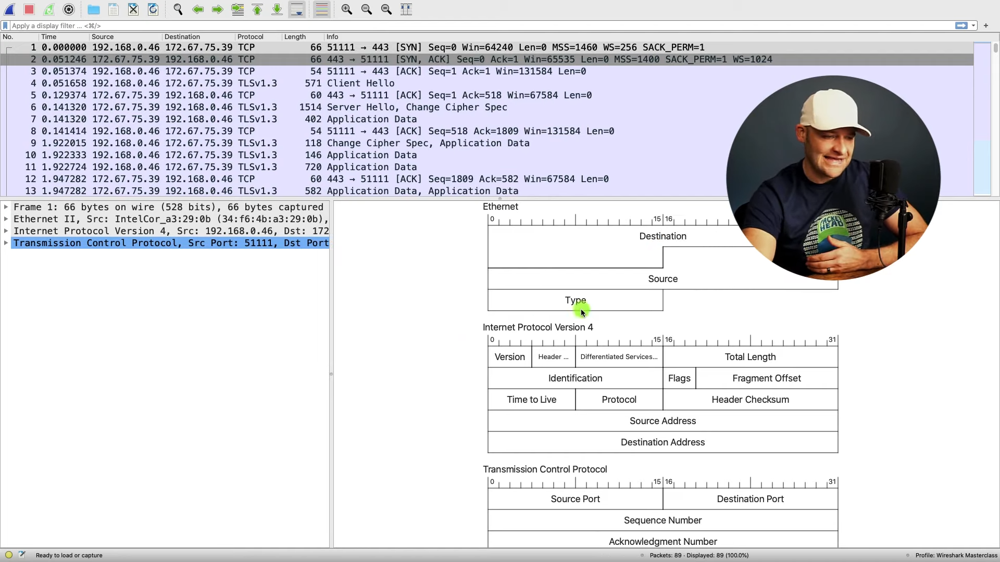 

You can then right click on the diagram and select `Show field values` to view the values within the diagram.
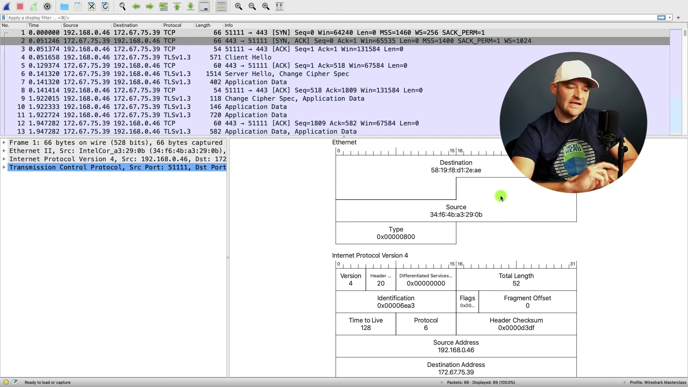 

## Adding a Column (Delta time)
Delta time is the time between each packet dispaly and is very useful when anylysing packets.  
1. Go to Preference > Appearance > Columns 
2. Click `+` button
3. Change the Title to `Delta`
4. Change the Type to `Delta time displayed`
5. Drag the entry to just under time. This will display the `Delta` column as the column right after time
6. Click OK
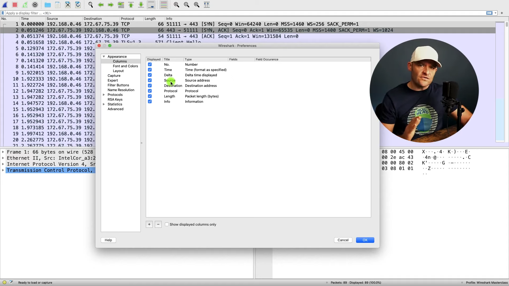 
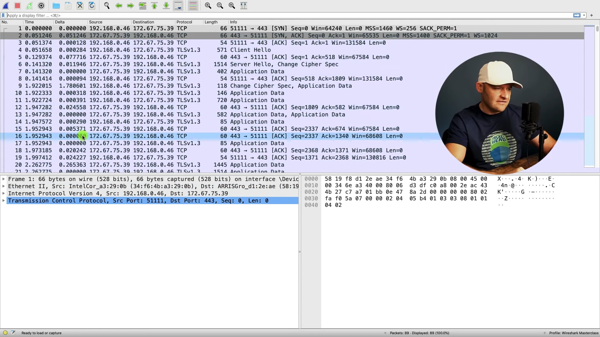 

## Changing the time format
To change the time format, go to `View` > `Time Display Format`. 
<b>Note: </b>If you choose the `Time of Day` it will use the local system clock to show the time and date. The time will be different on other devices depending on their device clock. 

## Coloring Rows
The packet capture is currently using a default colour scheme. Certain packets will have certain colours. In this case, we will be creating a custom light green filter for TCP SYNs messages. To create a custom color, do the following. 
1. Go to `View` > `Coloring Rules`
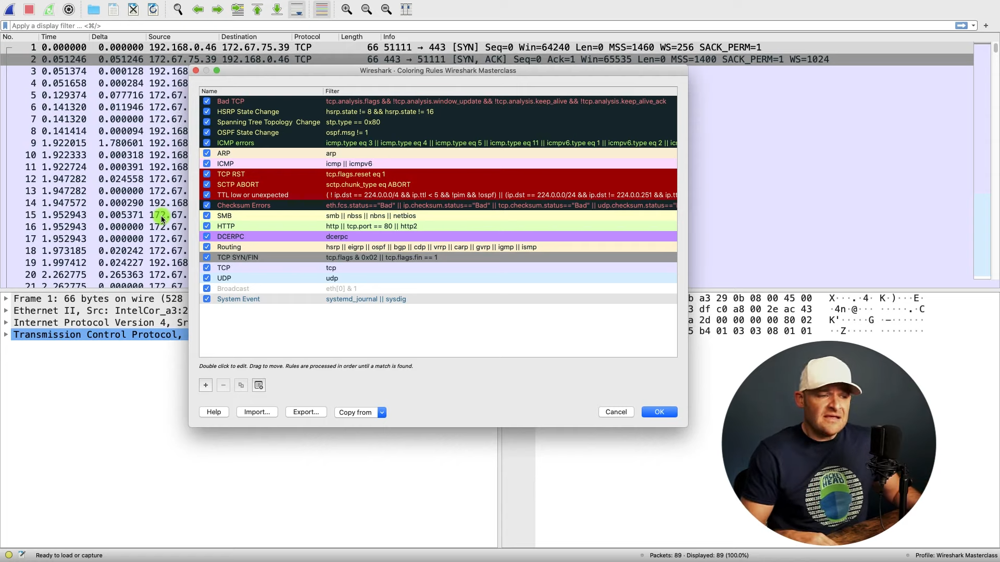 

2. Click `+`
3. Set the name to `TCP SYN`
4. Set the filter to `tcp.flags.syn==1`
5. Click `Background`, then select the colour you want (light green in this case)
6. Click `Foreground`, then select the colour you want (black in this case)
7. Drag the `TCP SYN` entry to just below the `Bad TCP` entry. This will just show the first TCP SYN for that connection, and won't show any more subsequent SYNs that occur due to error.
8. Click `OK`
9. Click `Reload this file` icon, the icon of a file with a reload sign at the top, as shown in the picture below

The packet capture should not highlight TCP SYN messages in light green. 
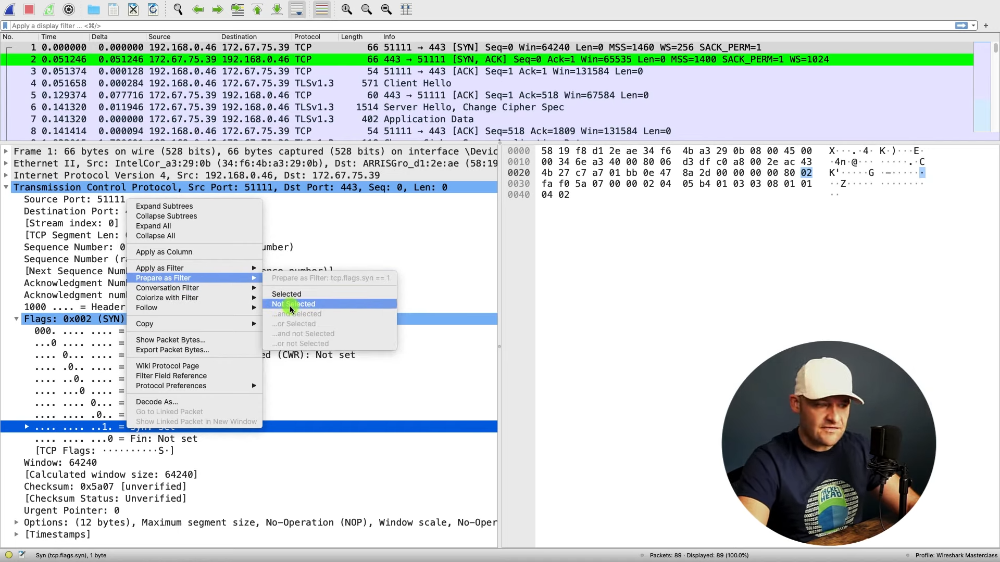 

## Trick for fast filtering
Instead of typing out the filter, you can just go to the packet details > right click item you want filtered > `Prepare as filter` > `Selected`. 
 

## Adding a button for quick filter
You can create a button that will automatically apply a filter. 
1. Click the `+` icon located at the top right of the packet capture
2. Add a name for the button and apply the filter 

You can see the button `TCP SYN` added below on the right.
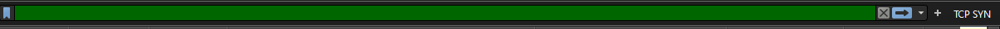 

## Faster way of adding a column
Right click the item you want added within the packet details > `Apply as Column`
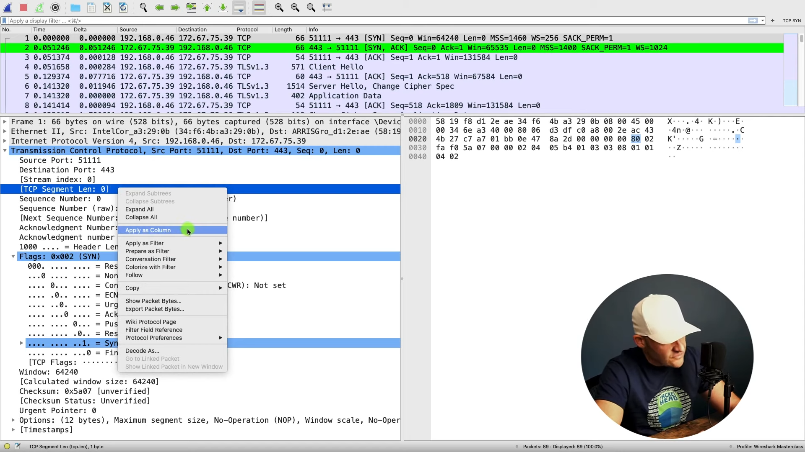 

## Removing column
Right click the header at the top > Uncheck the column you want OR `Remove from column`
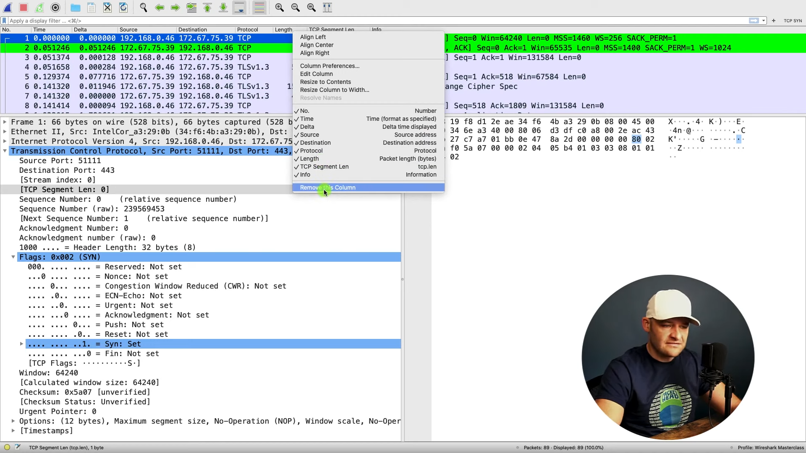 