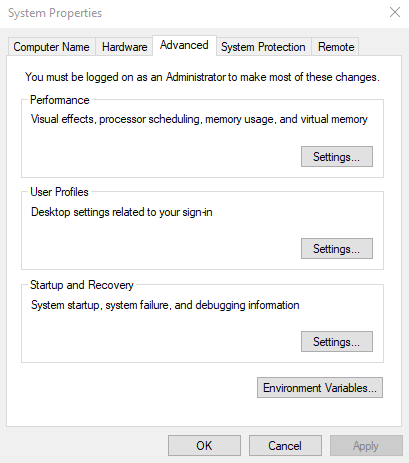
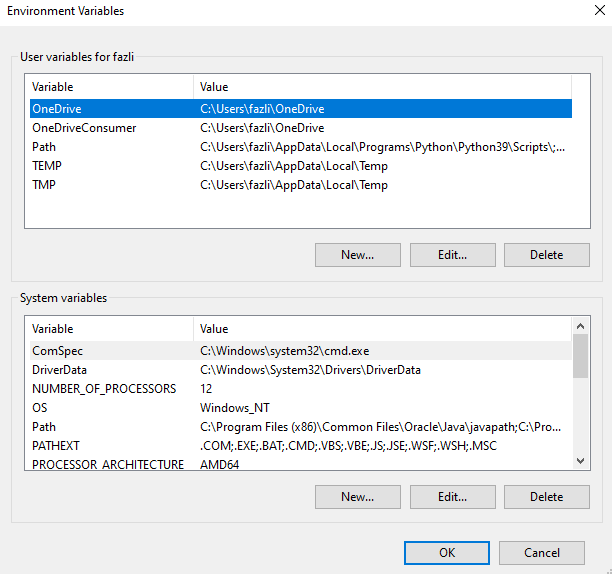

# Lesson 3 - Using Command Prompt
## Navigate to directory
Before doing any commands, you need to make sure that your current directory is at Wireshark. If you install it with default settings, it should be in the path `C:\Program Files\Wireshark`. To go to the directory in command prompt, you can use the command `cd C:\Program Files\Wireshark`.  

Another method is adding it to your PATH. This allows you to run the command without needing to navigate to the Wireshark directory. You will be able to run the commands in any directory you are at.
1. Press Win + S, search for "Environment Variables", and click "Edit the system environment variables".
2. In the System Properties window, click "Environment Variables…".
3. Under System variables (or User variables if you want it only for your account), find and select Path, then click Edit.
4. Click New, paste the folder path (e.g., C:\Your\Folder\Path), and click OK.
5. Close all dialogs and restart your terminal for changes to take effect.
 
 

## Viewing possible commands
Once you have completed the above steps, you can now view possible commands using the command `dumpcap -h`. You can see the output below.
 
 
 

### Viewing Interfaces
To view interfaces you can conduct packet capture on, use the command `dumpcap -D`.
 

## To do packet capture
If you want to conduct a packet capture, there are multiple possible commands that you can use.
- `dumpcap -i <interface>`: saves to a default location
- `dumpcap -i <interface> -w <directory>`: saves to a predetermined location 
- `dumpcap -i 6 -w /user/me/Desktop/sample.pcapng`: example command

To stop the capture, Ctrl+C.  

 

## Ring buffer
To configure settings to your packet capture, you can use the ring buffer flag. The options are as shown below. 

 

You can then use the command above and add the flags seen above. For example, `dumpcap -i <interface> -w <directory\filename.pcapng> -b filesize:100 –b files:2`.
- Sets the max filesize of the capture to 100kB
- Sets the max number of files saved to be 2, the writing over the 1st file if both files become full 
To stop the capture, Ctrl+C. 

 