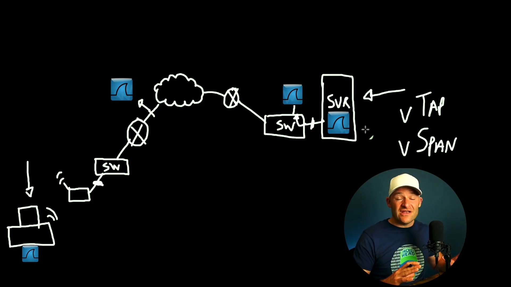

# Where do we capture packets?
Do we capture packets at server or endpoints? Where should we install wireshark and start capturing packets. The answer depends on what the problem is and where in the network we have access to.

## Locations

If we are able to, we would want to have 3 network taps,
- 1 close to the AP
- 1 close to the server
- 1 close to the internet provider 
You can also make use of span/monitor ports, which are ports that tell the switch to send data from 1 interface to another. 
 

If you have no access at all to the network, then you can only install wireshark on the client device and view packet capture from the device. The best would be to have wireshark capturing packet on the network itself. It is also good to have simultaneous client and server packet capture so we are able to view how the client and server are responding to each other. 

<b>Note:</b> It is not good to directly install wireshark on the server itself since it is already busy providing service for the network. Rather, you should either do a virtual tap or span. 

 

<b>Best Practices:</b>
- Get as close as possible to both end points
- Don't do it physically on both end points, rather, use tap or span off the network
- If security/network incident, you want to have packet capture on the pipe/link coming directly from the network (btw internet provider and your router).