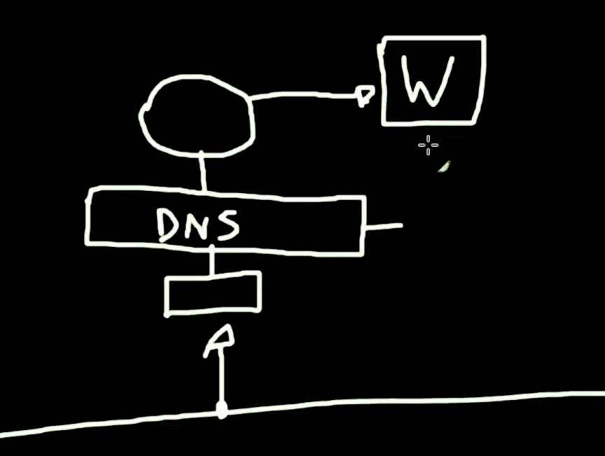
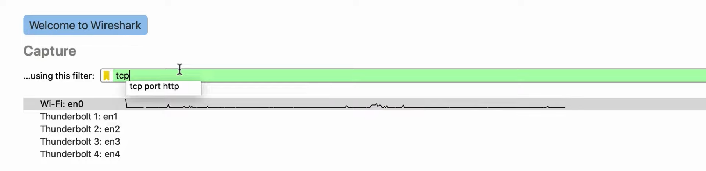
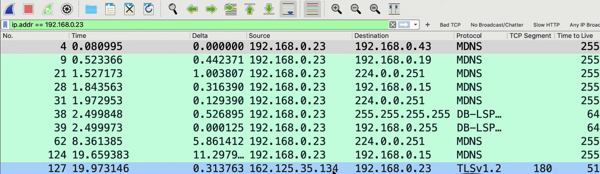
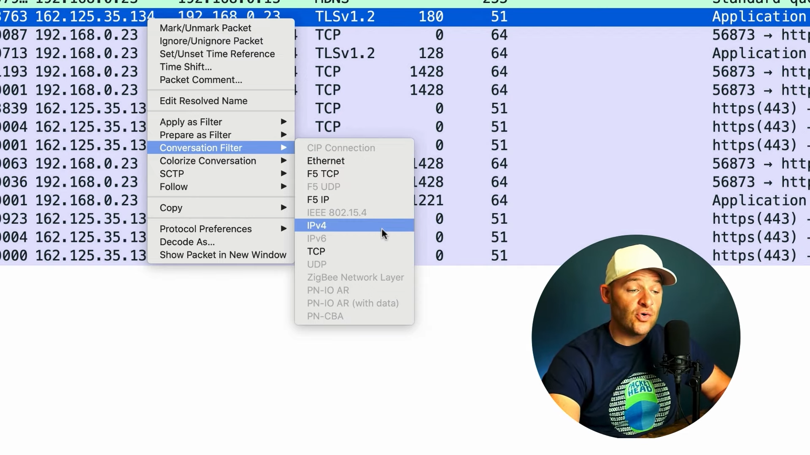
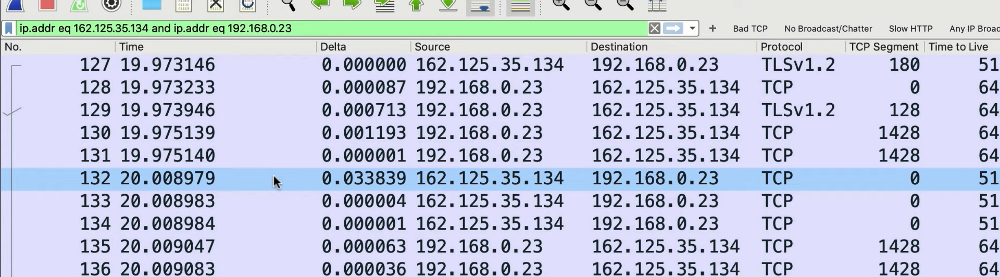
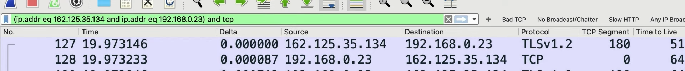
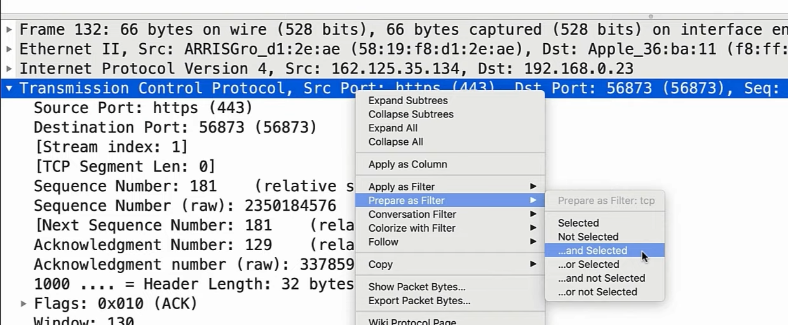
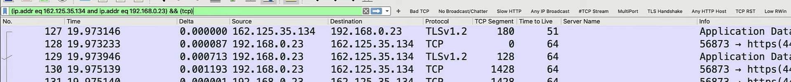

# Filtering Traffic
## Capture vs Display Filters
Before looking at how to filter traffic on wireshark, we first need to understand the difference between capture and display filters. To understand it, we need to look at how wireshark conducts packet caputre. 

 

1. First, the packets goes through the NIC (Network Interface Card) of the device wireshark is installed on
2. It will then be filtered by the capture filter (pre-filtering), where only certain type of traffic (DNS in this case), will be captured
3. It will then go to the device and onto wireshark
4. In wireshark, you can then use display filter (post-filtering), where it filters whatever that have been captured

## Creating Capture Filters
To create a capture filter, you will need to write the filter in the interface selection page. 

<b>Note</b>: Don't be too specific in the filters as you may miss out important traffic.

 

## Display Filter Syntax
To create a display filter, you will just need to key in the filter at the top of the packet capture as shown below. 

 

For more specific captures, for example you want to view packets coming from a specific source IP, you can do the following. Right click IP > `Conversation Filter` > `IPv4`. 

 

The result will be like this: 

 

## #Extending the filter
If you want to add additional parameters to your filter, you can do so by placing brackets around your current filter and add the word `and` followed by your additional filter. The syntax is  `(<current_filter>) and <additional_filter>`. 

 

Another method is to right click on the thing you want to add in the packet information > `Prepare as Filter` > `...and Selected`. 

 

The result will be: 

 

## Other tips & tricks
- `not (<filter>)`
- `tcp.port in {80 443}`
- String filter
  - `<packet_type> [contains|matches] <string>`
  - `contains`: case sensitive, `matches`: case insensitive
  - Examples
    - `frame contains google`
    - `frame matches google`