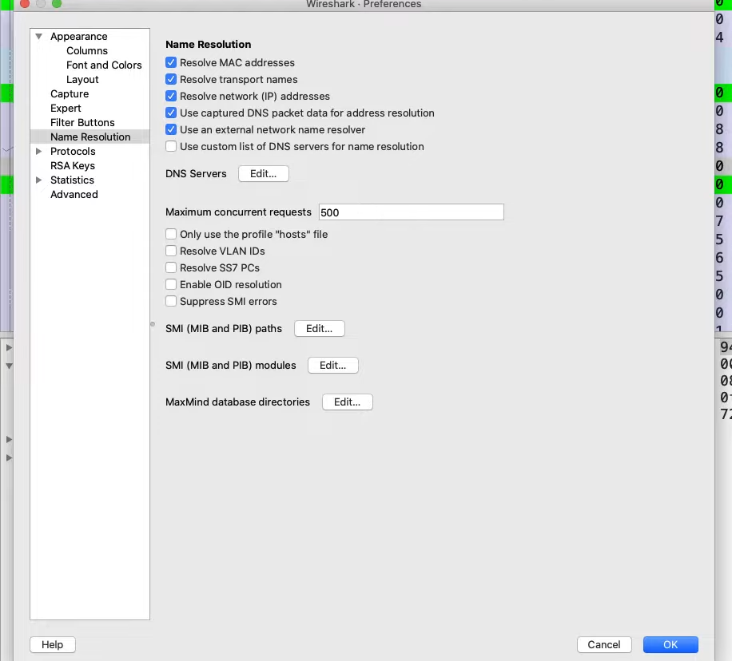
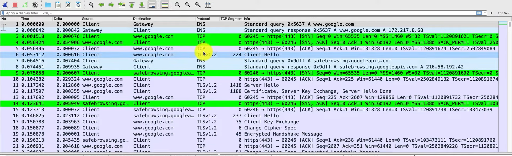
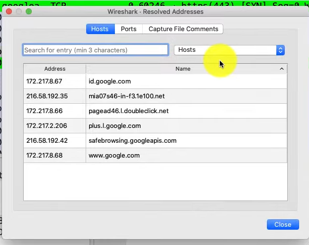

# Name Resolution
It is very difficult for us to look at IP addresses and port numbers and see what is really happening. Instead, it would be easier if we gave names to these IP addresses and port numbers. 

## Configuration
To configure names, first go to `Edit` > `Preference` > `Name Resolution`. You will see the settings appear as shown below. 

 

- `Resolve transport names`
  - Converts the port numbers to names of well-known port numbers
  - E.g port 443 -> https
- `Resolve network (IP) addresses`
  - If you enable this setting, the 3 additional settings below it will apear
  - `Use captured DNS packet data for address resolution`
    - Wireshark will use DNS packet capture to convert IP addresses to domain names
    - For example, if wireshark capture DNS packets that converts an IP address to `google.com`, wireshark will then convert that ip address to `google.com` in the list
  - `Use an external network name resolver`
    - Wireshark will use the device to generate DNS requests for name resolution 

 

You can see that IP address column is using names instead of IP addresses.

## Viewing Resolved Address
To view the list of resolved addresses, go to `Statistics` > `Resolved Addresses`. 

 

## Setting Custom Names
If you want to set a specific IP address to a custom name, you can do so by right clicking the desired IP address on the list of packet captures > `Edit resolved name` > Enter the name you want.  

 

You can see the IP address now has `Client` and `Gateway`.