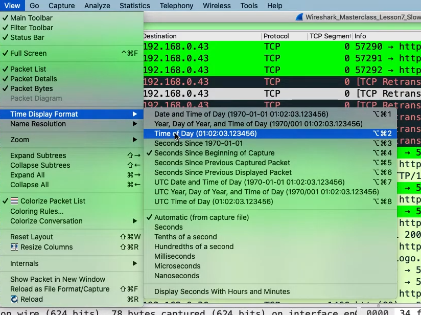
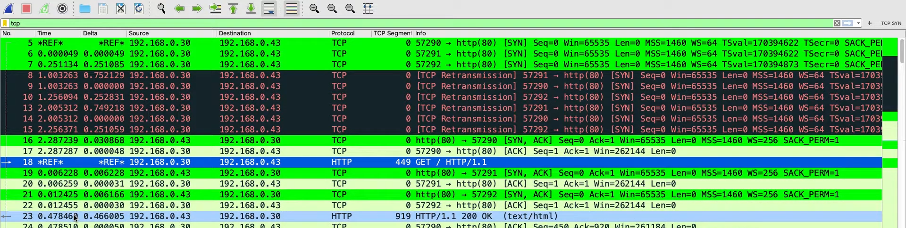
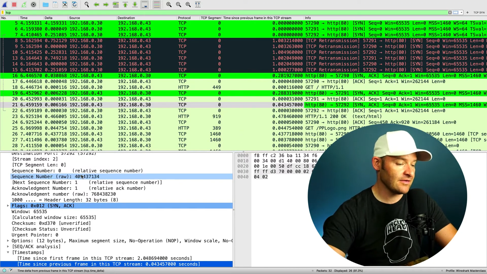

# Using Time Column
The timing columns are important when analysing packet capture. In this lesson, we will grow through some of the configurations related with the timing columns.

## Time Display Format
This settings are already mentioned in Lesson 1, but we will go through it again. The `Time` column in the list of packet capture can be configured to show different types of timings. To do so, `View` > `Time Display Format`. From there, you can choose which format you want. 

<b>Note:</b> If you choose the `Time of Day` format, wireshark will use the system/device clock. So, if you send the pcapng file to others, the timing shown on their system may be different based on their time zone. If they are 2 hours behind, then the timing will be 2 hours slower.

 

## Setting Time Reference
The default timing format in wireshark is `Seconds Since Beginning of Capture`. It takes the first packet captured as the start reference, meaning the first capture begins at time 0.0s. You can change which packet becomes the reference by right clicking the packet you want to be the reference at the `Time` column > `Set time reference`. That packet timing will then become 0.0s. You can also set multiple time references if you wish to do so. 

 

As you can see in the picture above, packets 5 and 18 have the time set as `*REF*`, meaning they are the time reference. 

To remove all the time references, you can go to `Edit` > `Unset all time reference`.

## Setting time based on connections
When they are multiple TCP connections, the delta time may not be very useful since. You will want to see when the time when the last packet within the same TCP connection was sent instead. You can do so by following the steps below: 
- Click on 1 of the packets > Scroll down to `Timestamps` in the packet information > Expand `Timestamps` > Right click `Time since previous time in this TCP stream` > `Apply as header`. 

You can sort the time by clicking the arrow located at the right side of the header at the top of the list. 

 

<b>Note:</b>
- Be careful since at the end of connections, there may be timeouts and resets 
   - Make sure not checking FINs and resets that are closing the connections 
- Look for the larger delays, especially coming from the servers 
  - Means that the server was waiting before letting go of data 