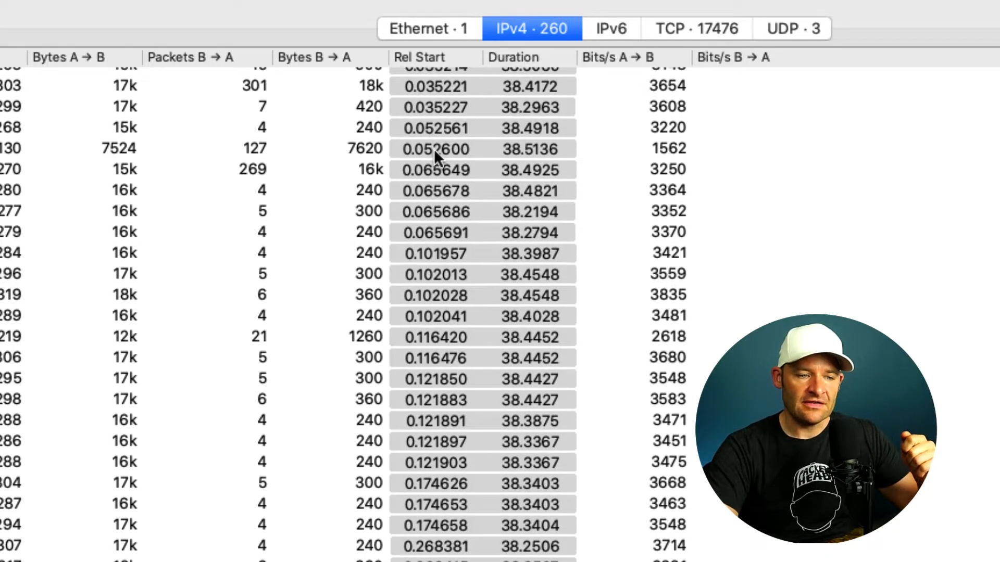
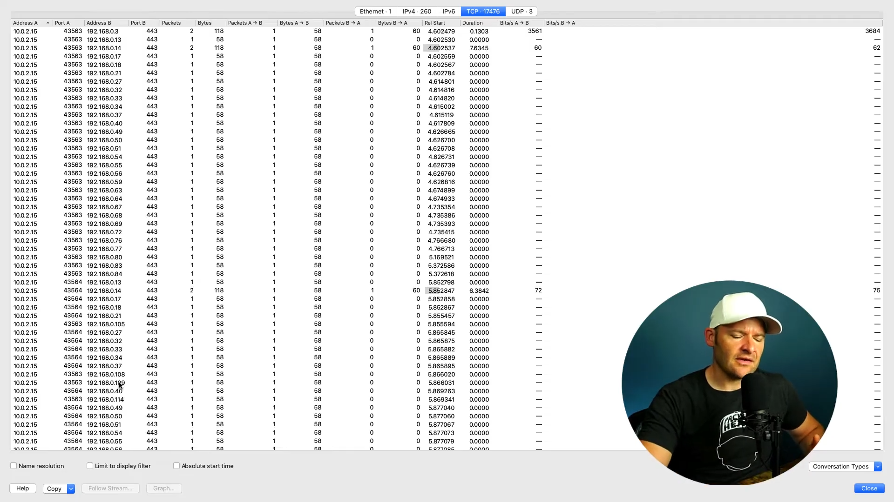
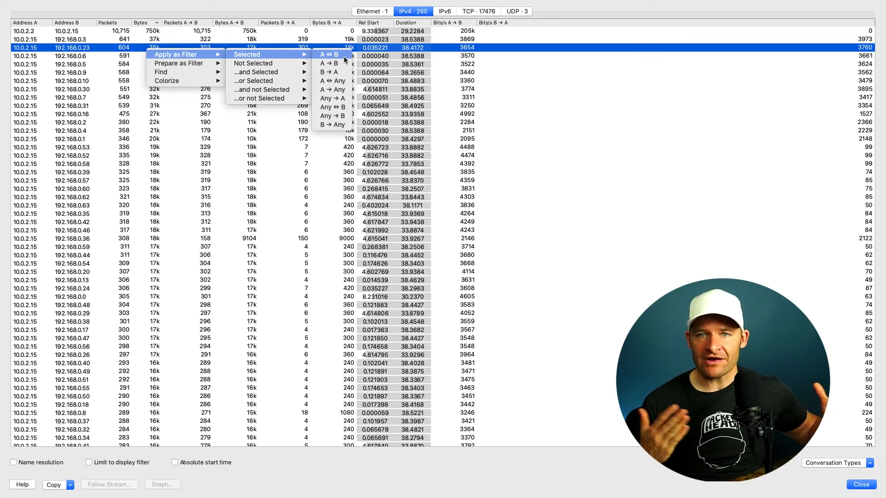

# Reading PCAPs with Wireshark Statistics
It may be difficult to figure out what is happening just by looking at the packet capture. To have a deeper look into what is happening, you can use the `Statistic` feature that is built into Wireshark.

## Wireshark Statistics
To navigate to the statistics, `Statistics` > `Conversations`. Here you can view the statistics based on each particular conversations.
- `Rel start`: Relative start, at which timing the conversation began in the packet capture
- `Duration`: how long the conversation lasted before it terminated 

You can notice that the 2 columns have a shaded color as their background. It actually shows you the duration of their conversation. If the duration is longer, the length of the grey background will be longer. 

 

## Quick Analysis
You can see that a single IP is having conversations with all the ports. It may be that the user is scanning through all the ports to find any empty ports. He may also be trying to hide the fact he is doing so by not scanning in a sequential order. 

 

## Viewing Specific Conversations
To view specific conversations in the packet capture list, right click the conversation you want > `Apply as filter` > `Selected` > `A <-> B` (bi-directional). Wireshark will then automatically filter the 2 end points. You can also filter based on TCP, IP, UDP etc. 

 