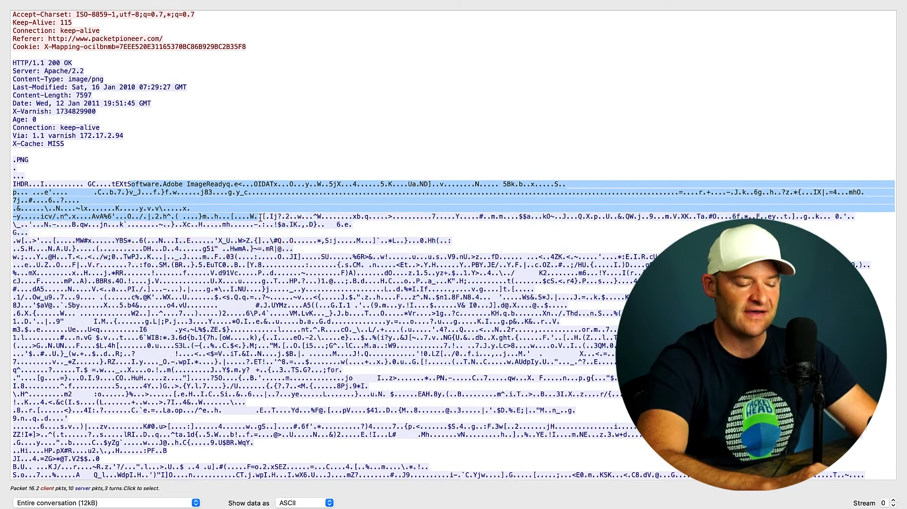

# Extracting Files from PCAPs
When looking through the packet capture list, you can view the data in the form of hexadecimals. However you can view the extract the contents of the packet and view it like a normal file. You can view it in different kinds of format, depending on the type that it was sent in (e.g. HTTP, PNG).

## Extracting the file
In this scenario, we will be extracting a .png file sent using a HTTP GET message as shown in packet 14 below. To extract the file, select the packet capture > Go to the packet information > Right click `Transmission Control Protocol` > `Protocol Preferences` > Make sure to tick `Allow subdissector to reassemble TCP streams` (wireshark will treat the TCP stream as a single packet, else will it treat it as multiple packets). 

Then, `File` > `Export Object` > `HTTP` > Choose the packet you want > `Save`.

 

## Extracting raw file
If you are unable to do the steps above, you can still view the raw file. Right click the packet you want on the list of packet captures > `Follow` > `TCP Stream`. 

 

 